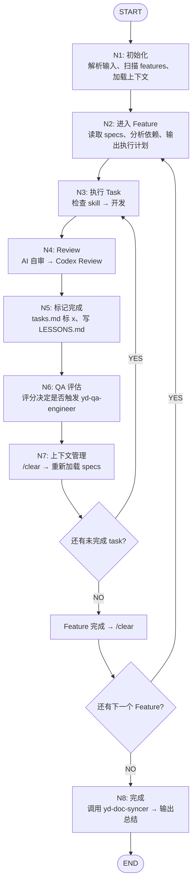

# /yd:ai — 自动开发

`$ARGUMENTS` — specs 文件夹路径 + 代码项目路径。

```bash
/yd:ai specs在~/projects/my-app-specs，代码在~/code/my-app
/yd:ai ~/projects/specs 前端~/code/fe 后端~/code/api
```

## 流程图

按此流程执行，到达每个节点时读取 `~/.claude/commands/yd-ai-nodes/` 下对应的节点文件获取详细规则。



## 全局规则

**节点执行规则（强制）：**

- 每个节点必须按顺序执行，**严禁跳过任何节点**
- 进入每个节点前，必须先读取 `~/.claude/commands/yd-ai-nodes/` 下对应的节点文件
- 每个节点执行完毕后，必须输出确认行，格式：`✓ [节点名] 完成，进入 [下一节点名]`
- 未完成当前节点前，不得进入下一节点

**节点文件映射（每次必须读取）：**

- N1 → `~/.claude/commands/yd-ai-nodes/N1-init.md`
- N2 → `~/.claude/commands/yd-ai-nodes/N2-enter-feature.md`
- N3 → `~/.claude/commands/yd-ai-nodes/N3-execute-task.md`
- N4 → `~/.claude/commands/yd-ai-nodes/N4-review.md`
- N5 → `~/.claude/commands/yd-ai-nodes/N5-mark-done.md`
- N6 → `~/.claude/commands/yd-ai-nodes/N6-qa-eval.md`
- N7 → `~/.claude/commands/yd-ai-nodes/N7-context.md`
- N8 → `~/.claude/commands/yd-ai-nodes/N8-finish.md`

**暂停：** 业务逻辑歧义、不确定的安全问题、破坏性变更、环境阻塞。
**不暂停：** 纯技术选型 — 选最优解直接执行。

**执行策略：** AI 自主决策串行或并行（无依赖 + 不同项目 → 并行，否则串行）。
